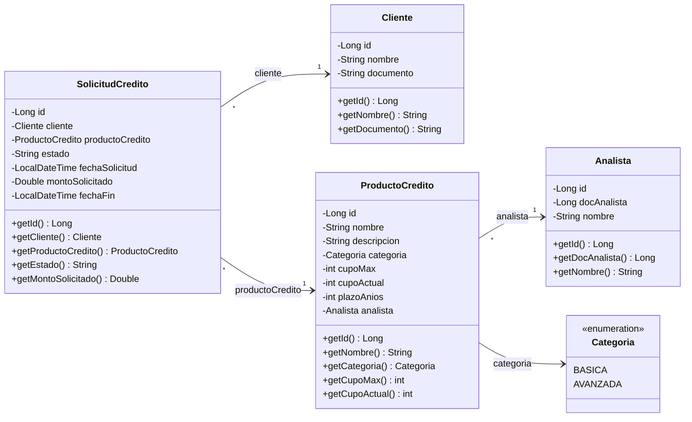

# Diagrama de Clases - Módulo Financiero

## Entidades (Modelo de dominio)

```mermaid
classDiagram
    direction LR

    class Categoria {
        <<enumeration>>
        BASICA
        AVANZADA
    }

    class Analista {
        -Long id
        -Long docAnalista
        -String nombre
        +getId() Long
        +getDocAnalista() Long
        +getNombre() String
    }

    class Cliente {
        -Long id
        -String nombre
        -String documento
        +getId() Long
        +getNombre() String
        +getDocumento() String
    }

    class ProductoCredito {
        -Long id
        -String nombre
        -String descripcion
        -Categoria categoria
        -int cupoMax
        -int cupoActual
        -int plazoAnios
        -Analista analista
        +getId() Long
        +getNombre() String
        +getCategoria() Categoria
        +getCupoMax() int
        +getCupoActual() int
    }

    class SolicitudCredito {
        -Long id
        -Cliente cliente
        -ProductoCredito productoCredito
        -String estado
        -LocalDateTime fechaSolicitud
        -Double montoSolicitado
        -LocalDateTime fechaFin
        +getId() Long
        +getCliente() Cliente
        +getProductoCredito() ProductoCredito
        +getEstado() String
        +getMontoSolicitado() Double
    }

    SolicitudCredito "*" --> "1" Cliente : cliente
    SolicitudCredito "*" --> "1" ProductoCredito : productoCredito
    ProductoCredito "*" --> "1" Analista : analista
    ProductoCredito --> Categoria : categoria
```

## Arquitectura completa (Controller → Service → Repository)

```mermaid
classDiagram
    direction TB

    %% Controllers
    class AnalistaController {
        -AnalistaService service
        +listar() List~Analista~
        +guardar(Analista) Analista
        +buscarPorId(Long) Analista
        +actualizar(Long, Analista) Analista
        +eliminar(Long) ResponseEntity
    }

    class ClienteController {
        -ClienteService service
        +listar() List~Cliente~
        +guardar(Cliente) Cliente
        +buscarPorId(Long) Cliente
        +actualizar(Long, Cliente) Cliente
        +eliminar(Long) ResponseEntity
    }

    class ProductoCreditoController {
        -ProductoCreditoService service
        +listar() List~ProductoCredito~
        +guardar(ProductoCredito) ProductoCredito
        +buscarPorId(Long) ProductoCredito
        +actualizar(Long, ProductoCredito) ProductoCredito
        +eliminar(Long) ResponseEntity
    }

    class SolicitudCreditoController {
        -SolicitudCreditoService service
        +listar() List~SolicitudCredito~
        +guardar(SolicitudCredito) SolicitudCredito
        +buscarPorId(Long) SolicitudCredito
        +actualizarEstado(Long, Map) ResponseEntity
        +eliminar(Long) ResponseEntity
    }

    %% Services
    class AnalistaService {
        -AnalistaRepository repository
        +listar() List~Analista~
        +guardar(Analista) Analista
        +buscarPorId(Long) Analista
        +eliminar(Long) void
    }

    class ClienteService {
        -ClienteRepository repository
        +listar() List~Cliente~
        +guardar(Cliente) Cliente
        +buscarPorId(Long) Cliente
        +eliminar(Long) void
    }

    class ProductoCreditoService {
        -ProductoCreditoRepository repository
        -SolicitudCreditoRepository solicitudRepo
        +listar() List~ProductoCredito~
        +guardar(ProductoCredito) ProductoCredito
        +buscarPorId(Long) ProductoCredito
        +eliminar(Long) void
    }

    class SolicitudCreditoService {
        -SolicitudCreditoRepository repo
        -ProductoCreditoRepository productoRepo
        -ClienteRepository clienteRepo
        +listar() List~SolicitudCredito~
        +guardar(SolicitudCredito) SolicitudCredito
        +actualizarEstado(Long, String) SolicitudCredito
        +buscarPorId(Long) SolicitudCredito
        +eliminar(Long) void
        +liberarCupo(Long) void
    }

    %% Repositories
    class AnalistaRepository {
        <<interface>>
        JpaRepository~Analista, Long~
    }

    class ClienteRepository {
        <<interface>>
        JpaRepository~Cliente, Long~
    }

    class ProductoCreditoRepository {
        <<interface>>
        JpaRepository~ProductoCredito, Long~
    }

    class SolicitudCreditoRepository {
        <<interface>>
        JpaRepository~SolicitudCredito, Long~
        +existsByClienteDocumentoAndProductoCreditoIdAndEstado()
        +countByClienteDocumentoAndEstado()
        +existsByClienteDocumentoAndProductoCreditoCategoriaAndEstado()
        +existsByProductoCreditoId()
    }

    %% Exceptions
    class GlobalExceptionHandler {
        +handleBadRequest(BadRequestException) ResponseEntity
        +handleConflict(ConflictException) ResponseEntity
        +handleRuntimeException(RuntimeException) ResponseEntity
    }

    class BadRequestException {
        +BadRequestException(String)
    }

    class ConflictException {
        +ConflictException(String)
    }

    %% Relaciones Controller → Service
    AnalistaController --> AnalistaService
    ClienteController --> ClienteService
    ProductoCreditoController --> ProductoCreditoService
    SolicitudCreditoController --> SolicitudCreditoService

    %% Relaciones Service → Repository
    AnalistaService --> AnalistaRepository
    ClienteService --> ClienteRepository
    ProductoCreditoService --> ProductoCreditoRepository
    ProductoCreditoService --> SolicitudCreditoRepository
    SolicitudCreditoService --> SolicitudCreditoRepository
    SolicitudCreditoService --> ProductoCreditoRepository
    SolicitudCreditoService --> ClienteRepository

    %% Exceptions
    GlobalExceptionHandler ..> BadRequestException
    GlobalExceptionHandler ..> ConflictException
    BadRequestException --|> RuntimeException
    ConflictException --|> RuntimeException
```
