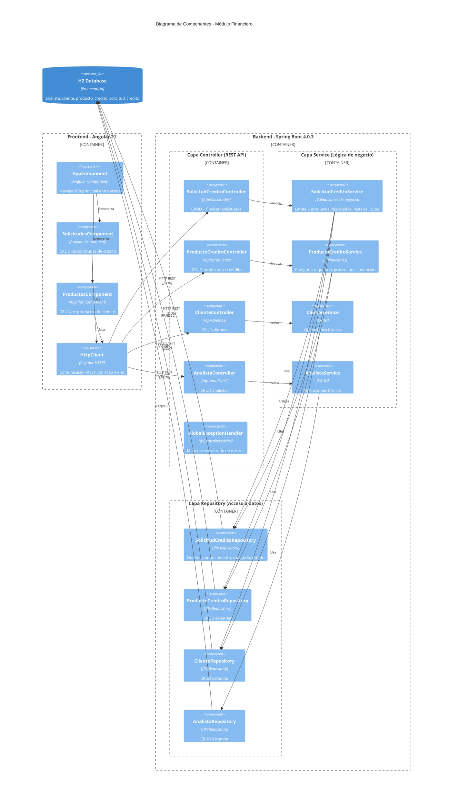
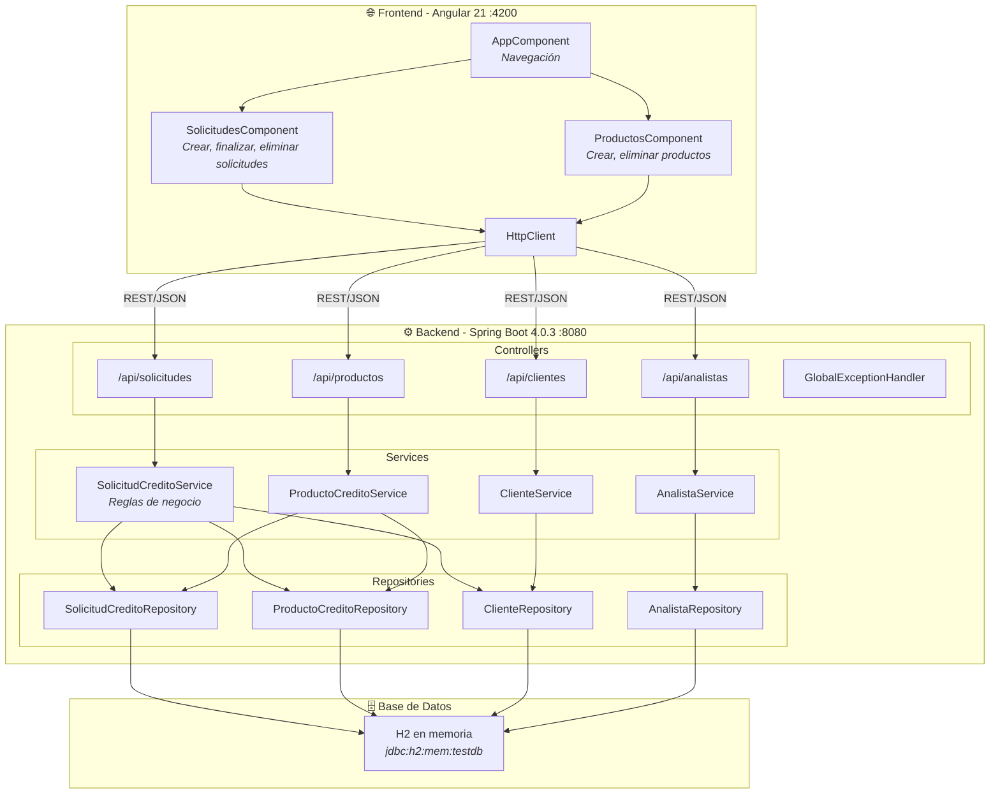
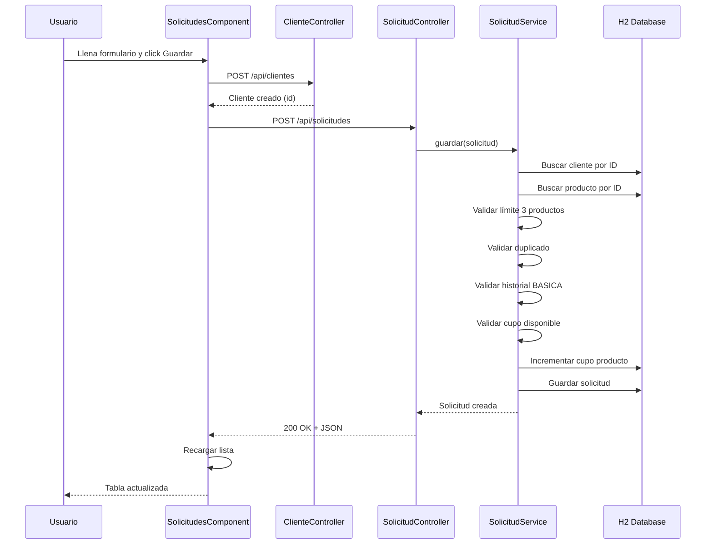

# Diagrama de Componentes - Módulo Financiero

## Vista general del sistema

```mermaid
C4Component
    title Diagrama de Componentes - Módulo Financiero

    Container_Boundary(frontend, "Frontend - Angular 21") {
        Component(appComp, "AppComponent", "Angular Component", "Navegación principal entre vistas")
        Component(solComp, "SolicitudesComponent", "Angular Component", "CRUD de solicitudes de crédito")
        Component(prodComp, "ProductosComponent", "Angular Component", "CRUD de productos de crédito")
        Component(httpClient, "HttpClient", "Angular HTTP", "Comunicación REST con el backend")
    }

    Container_Boundary(backend, "Backend - Spring Boot 4.0.3") {

        Container_Boundary(controllers, "Capa Controller (REST API)") {
            Component(solCtrl, "SolicitudCreditoController", "/api/solicitudes", "CRUD + finalizar solicitudes")
            Component(prodCtrl, "ProductoCreditoController", "/api/productos", "CRUD productos de crédito")
            Component(cliCtrl, "ClienteController", "/api/clientes", "CRUD clientes")
            Component(anaCtrl, "AnalistaController", "/api/analistas", "CRUD analistas")
            Component(exHandler, "GlobalExceptionHandler", "@ControllerAdvice", "Manejo centralizado de errores")
        }

        Container_Boundary(services, "Capa Service (Lógica de negocio)") {
            Component(solSvc, "SolicitudCreditoService", "Validaciones de negocio", "Límite 3 productos, duplicados, historial, cupo")
            Component(prodSvc, "ProductoCreditoService", "Validaciones", "Categoría requerida, protección eliminación")
            Component(cliSvc, "ClienteService", "CRUD", "Operaciones básicas")
            Component(anaSvc, "AnalistaService", "CRUD", "Operaciones básicas")
        }

        Container_Boundary(repos, "Capa Repository (Acceso a datos)") {
            Component(solRepo, "SolicitudCreditoRepository", "JPA Repository", "Queries por documento, categoría, estado")
            Component(prodRepo, "ProductoCreditoRepository", "JPA Repository", "CRUD estándar")
            Component(cliRepo, "ClienteRepository", "JPA Repository", "CRUD estándar")
            Component(anaRepo, "AnalistaRepository", "JPA Repository", "CRUD estándar")
        }
    }

    ContainerDb(db, "H2 Database", "En memoria", "analista, cliente, producto_credito, solicitud_credito")

    Rel(appComp, solComp, "Renderiza")
    Rel(appComp, prodComp, "Renderiza")
    Rel(solComp, httpClient, "Usa")
    Rel(prodComp, httpClient, "Usa")

    Rel(httpClient, solCtrl, "HTTP REST", "JSON")
    Rel(httpClient, prodCtrl, "HTTP REST", "JSON")
    Rel(httpClient, cliCtrl, "HTTP REST", "JSON")
    Rel(httpClient, anaCtrl, "HTTP REST", "JSON")

    Rel(solCtrl, solSvc, "Invoca")
    Rel(prodCtrl, prodSvc, "Invoca")
    Rel(cliCtrl, cliSvc, "Invoca")
    Rel(anaCtrl, anaSvc, "Invoca")

    Rel(solSvc, solRepo, "Usa")
    Rel(solSvc, prodRepo, "Usa")
    Rel(solSvc, cliRepo, "Usa")
    Rel(prodSvc, prodRepo, "Usa")
    Rel(prodSvc, solRepo, "Usa")
    Rel(cliSvc, cliRepo, "Usa")
    Rel(anaSvc, anaRepo, "Usa")

    Rel(solRepo, db, "JPA/JDBC")
    Rel(prodRepo, db, "JPA/JDBC")
    Rel(cliRepo, db, "JPA/JDBC")
    Rel(anaRepo, db, "JPA/JDBC")
```

## Interacción entre componentes (simplificado)

```mermaid
graph TB
    subgraph "🌐 Frontend - Angular 21 :4200"
        APP["AppComponent<br/><i>Navegación</i>"]
        SOL_C["SolicitudesComponent<br/><i>Crear, finalizar, eliminar solicitudes</i>"]
        PROD_C["ProductosComponent<br/><i>Crear, eliminar productos</i>"]
        HTTP["HttpClient"]

        APP --> SOL_C
        APP --> PROD_C
        SOL_C --> HTTP
        PROD_C --> HTTP
    end

    subgraph "⚙️ Backend - Spring Boot 4.0.3 :8080"
        subgraph "Controllers"
            SC["/api/solicitudes"]
            PC["/api/productos"]
            CC["/api/clientes"]
            AC["/api/analistas"]
            GEH["GlobalExceptionHandler"]
        end

        subgraph "Services"
            SS["SolicitudCreditoService<br/><i>Reglas de negocio</i>"]
            PS["ProductoCreditoService"]
            CS["ClienteService"]
            AS["AnalistaService"]
        end

        subgraph "Repositories"
            SR["SolicitudCreditoRepository"]
            PR["ProductoCreditoRepository"]
            CR["ClienteRepository"]
            AR["AnalistaRepository"]
        end

        SC --> SS
        PC --> PS
        CC --> CS
        AC --> AS

        SS --> SR
        SS --> PR
        SS --> CR
        PS --> PR
        PS --> SR
        CS --> CR
        AS --> AR
    end

    subgraph "🗄️ Base de Datos"
        H2["H2 en memoria<br/><i>jdbc:h2:mem:testdb</i>"]
    end

    HTTP -- "REST/JSON" --> SC
    HTTP -- "REST/JSON" --> PC
    HTTP -- "REST/JSON" --> CC
    HTTP -- "REST/JSON" --> AC

    SR --> H2
    PR --> H2
    CR --> H2
    AR --> H2
```

## Flujo de una solicitud de crédito

```mermaid
sequenceDiagram
    participant U as Usuario
    participant F as SolicitudesComponent
    participant B1 as ClienteController
    participant B2 as SolicitudController
    participant S as SolicitudService
    participant DB as H2 Database

    U->>F: Llena formulario y click Guardar
    F->>B1: POST /api/clientes
    B1-->>F: Cliente creado (id)
    F->>B2: POST /api/solicitudes
    B2->>S: guardar(solicitud)
    S->>DB: Buscar cliente por ID
    S->>DB: Buscar producto por ID
    S->>S: Validar límite 3 productos
    S->>S: Validar duplicado
    S->>S: Validar historial BASICA
    S->>S: Validar cupo disponible
    S->>DB: Incrementar cupo producto
    S->>DB: Guardar solicitud
    S-->>B2: Solicitud creada
    B2-->>F: 200 OK + JSON
    F->>F: Recargar lista
    F-->>U: Tabla actualizada
```
