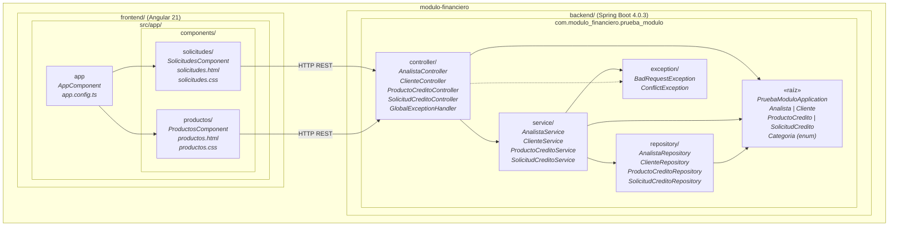
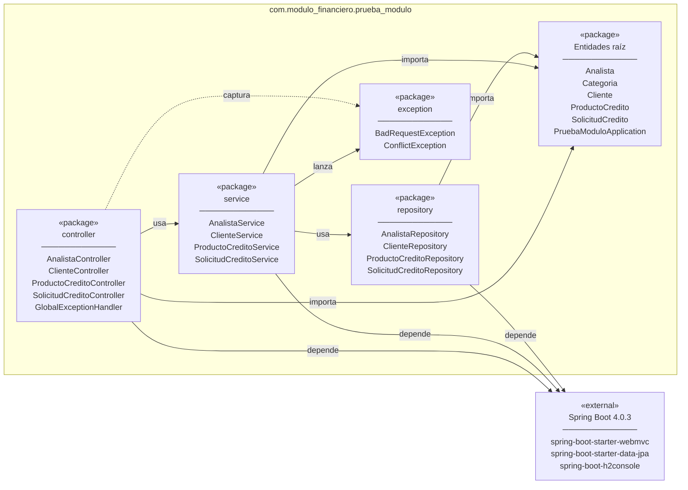
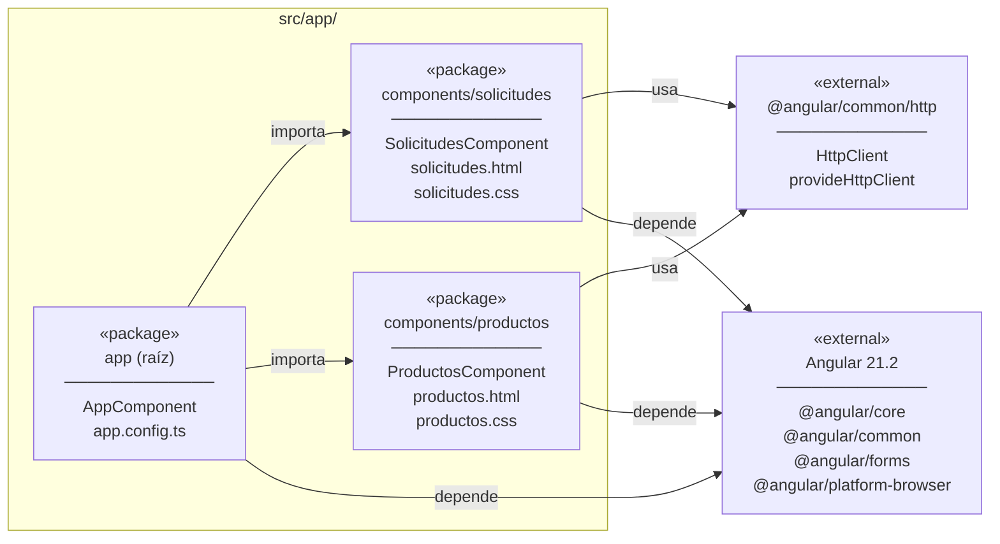

# Diagrama de Paquetes - Módulo Financiero

## Vista general del sistema

```mermaid
graph TB
    subgraph "modulo-financiero"

        subgraph "frontend/ (Angular 21)"
            subgraph "src/app/"
                APP_PKG["app<br/><i>AppComponent<br/>app.config.ts</i>"]

                subgraph "components/"
                    SOL_PKG["solicitudes/<br/><i>SolicitudesComponent<br/>solicitudes.html<br/>solicitudes.css</i>"]
                    PROD_PKG["productos/<br/><i>ProductosComponent<br/>productos.html<br/>productos.css</i>"]
                end
            end
        end

        subgraph "backend/ (Spring Boot 4.0.3)"
            subgraph "com.modulo_financiero.prueba_modulo"
                ROOT_PKG["«raíz»<br/><i>PruebaModuloApplication<br/>Analista | Cliente<br/>ProductoCredito | SolicitudCredito<br/>Categoria (enum)</i>"]

                CTRL_PKG["controller/<br/><i>AnalistaController<br/>ClienteController<br/>ProductoCreditoController<br/>SolicitudCreditoController<br/>GlobalExceptionHandler</i>"]

                SVC_PKG["service/<br/><i>AnalistaService<br/>ClienteService<br/>ProductoCreditoService<br/>SolicitudCreditoService</i>"]

                REPO_PKG["repository/<br/><i>AnalistaRepository<br/>ClienteRepository<br/>ProductoCreditoRepository<br/>SolicitudCreditoRepository</i>"]

                EXC_PKG["exception/<br/><i>BadRequestException<br/>ConflictException</i>"]
            end
        end
    end

    APP_PKG --> SOL_PKG
    APP_PKG --> PROD_PKG
    SOL_PKG -- "HTTP REST" --> CTRL_PKG
    PROD_PKG -- "HTTP REST" --> CTRL_PKG

    CTRL_PKG --> SVC_PKG
    CTRL_PKG --> ROOT_PKG
    SVC_PKG --> REPO_PKG
    SVC_PKG --> ROOT_PKG
    SVC_PKG --> EXC_PKG
    REPO_PKG --> ROOT_PKG
    CTRL_PKG -.-> EXC_PKG
```

## Detalle de dependencias entre paquetes del backend

```mermaid
graph LR
    subgraph "com.modulo_financiero.prueba_modulo"

        ENTITIES["«package»<br/>Entidades raíz<br/>─────────────<br/>Analista<br/>Categoria<br/>Cliente<br/>ProductoCredito<br/>SolicitudCredito<br/>PruebaModuloApplication"]

        CONTROLLER["«package»<br/>controller<br/>─────────────<br/>AnalistaController<br/>ClienteController<br/>ProductoCreditoController<br/>SolicitudCreditoController<br/>GlobalExceptionHandler"]

        SERVICE["«package»<br/>service<br/>─────────────<br/>AnalistaService<br/>ClienteService<br/>ProductoCreditoService<br/>SolicitudCreditoService"]

        REPOSITORY["«package»<br/>repository<br/>─────────────<br/>AnalistaRepository<br/>ClienteRepository<br/>ProductoCreditoRepository<br/>SolicitudCreditoRepository"]

        EXCEPTION["«package»<br/>exception<br/>─────────────<br/>BadRequestException<br/>ConflictException"]
    end

    SPRING["«external»<br/>Spring Boot 4.0.3<br/>─────────────<br/>spring-boot-starter-webmvc<br/>spring-boot-starter-data-jpa<br/>spring-boot-h2console"]

    CONTROLLER -- "usa" --> SERVICE
    CONTROLLER -- "importa" --> ENTITIES
    SERVICE -- "usa" --> REPOSITORY
    SERVICE -- "importa" --> ENTITIES
    SERVICE -- "lanza" --> EXCEPTION
    REPOSITORY -- "importa" --> ENTITIES
    CONTROLLER -. "captura" .-> EXCEPTION

    CONTROLLER -- "depende" --> SPRING
    SERVICE -- "depende" --> SPRING
    REPOSITORY -- "depende" --> SPRING
```

## Detalle de dependencias entre paquetes del frontend

```mermaid
graph LR
    subgraph "src/app/"

        APP["«package»<br/>app (raíz)<br/>─────────────<br/>AppComponent<br/>app.config.ts"]

        SOLICITUDES["«package»<br/>components/solicitudes<br/>─────────────<br/>SolicitudesComponent<br/>solicitudes.html<br/>solicitudes.css"]

        PRODUCTOS["«package»<br/>components/productos<br/>─────────────<br/>ProductosComponent<br/>productos.html<br/>productos.css"]
    end

    ANGULAR["«external»<br/>Angular 21.2<br/>─────────────<br/>@angular/core<br/>@angular/common<br/>@angular/forms<br/>@angular/platform-browser"]

    HTTP["«external»<br/>@angular/common/http<br/>─────────────<br/>HttpClient<br/>provideHttpClient"]

    APP -- "importa" --> SOLICITUDES
    APP -- "importa" --> PRODUCTOS
    SOLICITUDES -- "usa" --> HTTP
    PRODUCTOS -- "usa" --> HTTP
    APP -- "depende" --> ANGULAR
    SOLICITUDES -- "depende" --> ANGULAR
    PRODUCTOS -- "depende" --> ANGULAR
```
