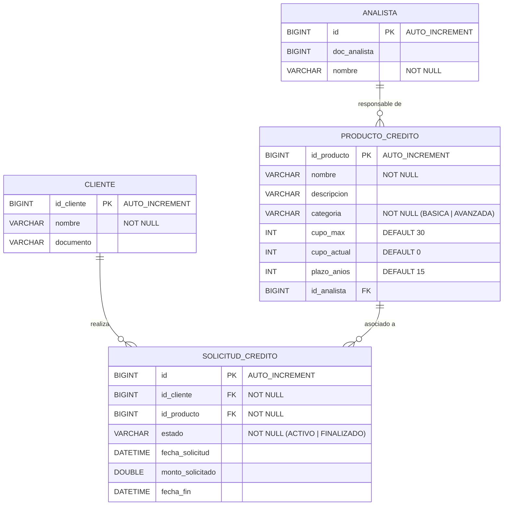

# Modelo Entidad-Relación - Módulo Financiero

```mermaid
erDiagram
    ANALISTA {
        BIGINT id PK "AUTO_INCREMENT"
        BIGINT doc_analista
        VARCHAR nombre "NOT NULL"
    }

    CLIENTE {
        BIGINT id_cliente PK "AUTO_INCREMENT"
        VARCHAR nombre "NOT NULL"
        VARCHAR documento
    }

    PRODUCTO_CREDITO {
        BIGINT id_producto PK "AUTO_INCREMENT"
        VARCHAR nombre "NOT NULL"
        VARCHAR descripcion
        VARCHAR categoria "NOT NULL (BASICA | AVANZADA)"
        INT cupo_max "DEFAULT 30"
        INT cupo_actual "DEFAULT 0"
        INT plazo_anios "DEFAULT 15"
        BIGINT id_analista FK
    }

    SOLICITUD_CREDITO {
        BIGINT id PK "AUTO_INCREMENT"
        BIGINT id_cliente FK "NOT NULL"
        BIGINT id_producto FK "NOT NULL"
        VARCHAR estado "NOT NULL (ACTIVO | FINALIZADO)"
        DATETIME fecha_solicitud
        DOUBLE monto_solicitado
        DATETIME fecha_fin
    }

    ANALISTA ||--o{ PRODUCTO_CREDITO : "responsable de"
    CLIENTE ||--o{ SOLICITUD_CREDITO : "realiza"
    PRODUCTO_CREDITO ||--o{ SOLICITUD_CREDITO : "asociado a"
```
