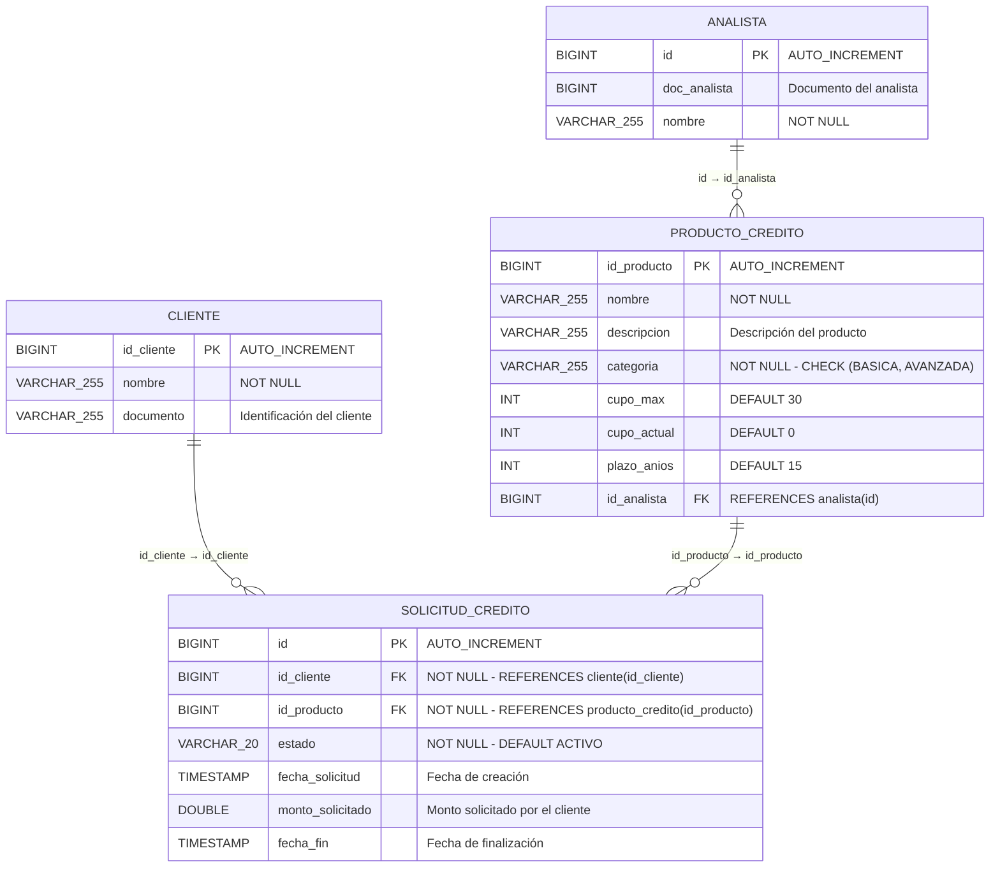

# Modelo Relacional - Módulo Financiero

## Diagrama relacional

## Definición de tablas (DDL)

### ANALISTA
| Columna | Tipo | Restricciones |
|---------|------|---------------|
| id | BIGINT | PK, AUTO_INCREMENT |
| doc_analista | BIGINT | - |
| nombre | VARCHAR(255) | NOT NULL |

### CLIENTE
| Columna | Tipo | Restricciones |
|---------|------|---------------|
| id_cliente | BIGINT | PK, AUTO_INCREMENT |
| nombre | VARCHAR(255) | NOT NULL |
| documento | VARCHAR(255) | - |

### PRODUCTO_CREDITO
| Columna | Tipo | Restricciones |
|---------|------|---------------|
| id_producto | BIGINT | PK, AUTO_INCREMENT |
| nombre | VARCHAR(255) | NOT NULL |
| descripcion | VARCHAR(255) | - |
| categoria | VARCHAR(255) | NOT NULL (BASICA \| AVANZADA) |
| cupo_max | INT | DEFAULT 30 |
| cupo_actual | INT | DEFAULT 0 |
| plazo_anios | INT | DEFAULT 15 |
| id_analista | BIGINT | FK → ANALISTA(id) |

### SOLICITUD_CREDITO
| Columna | Tipo | Restricciones |
|---------|------|---------------|
| id | BIGINT | PK, AUTO_INCREMENT |
| id_cliente | BIGINT | FK → CLIENTE(id_cliente), NOT NULL |
| id_producto | BIGINT | FK → PRODUCTO_CREDITO(id_producto), NOT NULL |
| estado | VARCHAR(20) | NOT NULL, DEFAULT 'ACTIVO' |
| fecha_solicitud | TIMESTAMP | Fecha de creación |
| monto_solicitado | DOUBLE | - |
| fecha_fin | TIMESTAMP | - |

## Relaciones

| Relación | Cardinalidad | FK | Descripción |
|----------|-------------|-----|-------------|
| ANALISTA → PRODUCTO_CREDITO | 1 : N | producto_credito.id_analista | Un analista es responsable de muchos productos |
| CLIENTE → SOLICITUD_CREDITO | 1 : N | solicitud_credito.id_cliente | Un cliente puede tener muchas solicitudes |
| PRODUCTO_CREDITO → SOLICITUD_CREDITO | 1 : N | solicitud_credito.id_producto | Un producto puede estar en muchas solicitudes |

## Restricciones de negocio (validadas en capa Service)

| Regla | Descripción | Error HTTP |
|-------|-------------|------------|
| Límite 3 activos | Un cliente (por documento) no puede tener más de 3 solicitudes con estado ACTIVO | 409 Conflict |
| Sin duplicados | Un cliente (por documento) no puede tener 2 solicitudes activas para el mismo producto | 409 Conflict |
| Historial requerido | Para solicitar un producto AVANZADO, el cliente debe tener al menos 1 producto BASICO con estado FINALIZADO | 400 Bad Request |
| Cupo disponible | cupo_actual no puede superar cupo_max del producto | 409 Conflict |
| Protección eliminación | No se puede eliminar un producto que tenga solicitudes asociadas | 409 Conflict |
